---
## Front matter
title: "Отчёт по лабораторной работе №3"
subtitle: "Система контроля версий Git"
author: "Городянский Фёдор Николаевич"

## Generic otions
lang: ru-RU
toc-title: "Содержание"

## Bibliography
bibliography: bib/cite.bib
csl: pandoc/csl/gost-r-7-0-5-2008-numeric.csl

## Pdf output format
toc: true # Table of contents
toc-depth: 2
lof: true # List of figures
lot: true # List of tables
fontsize: 12pt
linestretch: 1.5
papersize: a4
documentclass: scrreprt
## I18n polyglossia
polyglossia-lang:
  name: russian
  options:
	- spelling=modern
	- babelshorthands=true
polyglossia-otherlangs:
  name: english
## I18n babel
babel-lang: russian
babel-otherlangs: english
## Fonts
mainfont: PT Serif
romanfont: PT Serif
sansfont: PT Sans
monofont: PT Mono
mainfontoptions: Ligatures=TeX
romanfontoptions: Ligatures=TeX
sansfontoptions: Ligatures=TeX,Scale=MatchLowercase
monofontoptions: Scale=MatchLowercase,Scale=0.9
## Biblatex
biblatex: true
biblio-style: "gost-numeric"
biblatexoptions:
  - parentracker=true
  - backend=biber
  - hyperref=auto
  - language=auto
  - autolang=other*
  - citestyle=gost-numeric
## Pandoc-crossref LaTeX customization
figureTitle: "Рис."
tableTitle: "Таблица"
listingTitle: "Листинг"
lofTitle: "Список иллюстраций"
lotTitle: "Список таблиц"
lolTitle: "Листинги"
## Misc options
indent: true
header-includes:
  - \usepackage{indentfirst}
  - \usepackage{float} # keep figures where there are in the text
  - \floatplacement{figure}{H} # keep figures where there are in the text
---

# Цель работы

Изучить идеологию и применение средств контроля версий.
Приобрести практические навыки по работе с системой git.

# Задание

# Теоретическое введение

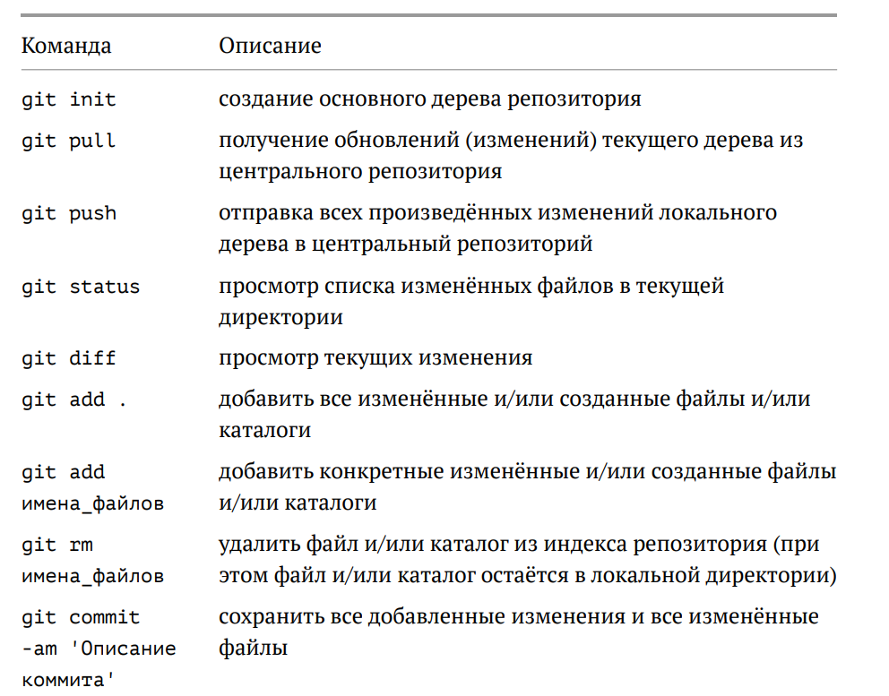 {#fig:001 width=70% }
Рис.1.1. Описание команд git.
 {#fig:001 width=70% }
Рис.1.2. Описание команд git.

# Выполнение лабораторной работы

1. Создал учетную запись в git.
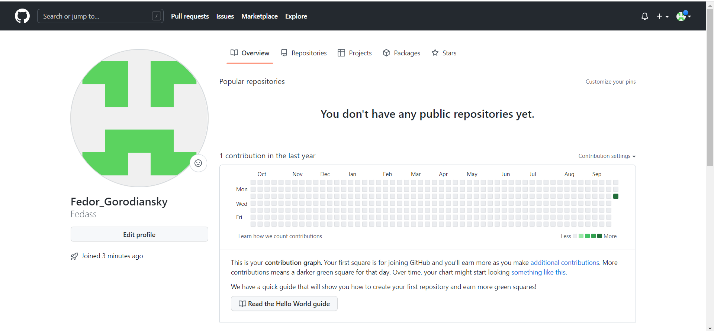 {#fig:001 width=70% }
Рис.2. Учетная запись в git.
2. Настроил git в терминале.
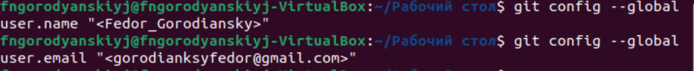  {#fig:001 width=70% }
Рис.2.1 Настройка git. Ввод имени и почты учетной записи.
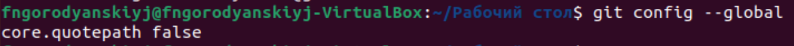  {#fig:001 width=70% }
Рис. 2.2 Настройка utf-8 в выводе сообщений git.
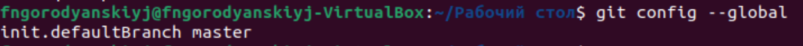  {#fig:001 width=70% }
Рис.2.3. Создание папки master.
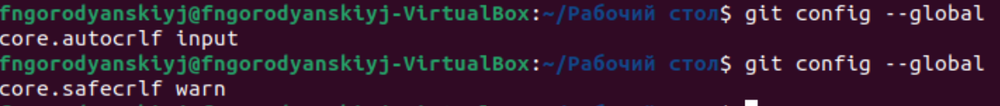  {#fig:001 width=70% }
Рис. 2.4. Использование параметров autocrlf и safecrlf.
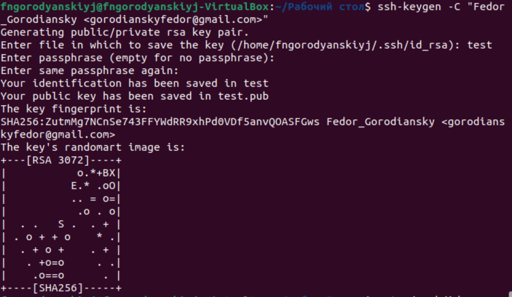  {#fig:001 width=70% }
Рис. 2.5. Создание ssh ключа в консоли Линукс.
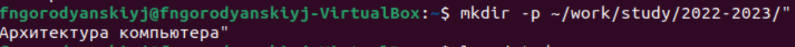  {#fig:001 width=70% }
Рис. 2.6. Создание каталога предмета “Архитектура компьютера”.
3. Настройка git на сервере.
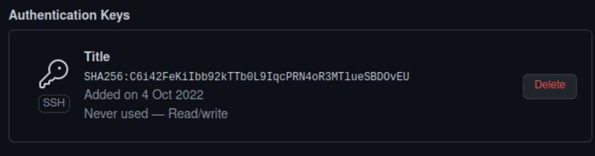  {#fig:001 width=70% }
Рис. 3.1. Создание ssh ключа в системе Git.
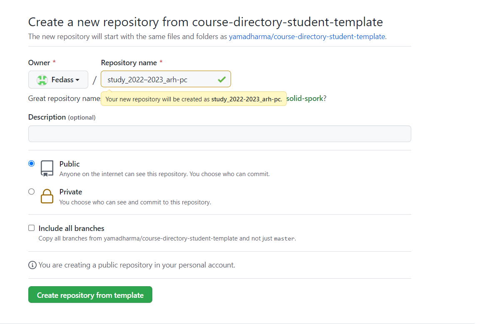  {#fig:001 width=70% }
Рис. 3.2. Создание репозитория study_2022–2023_arh-pc.
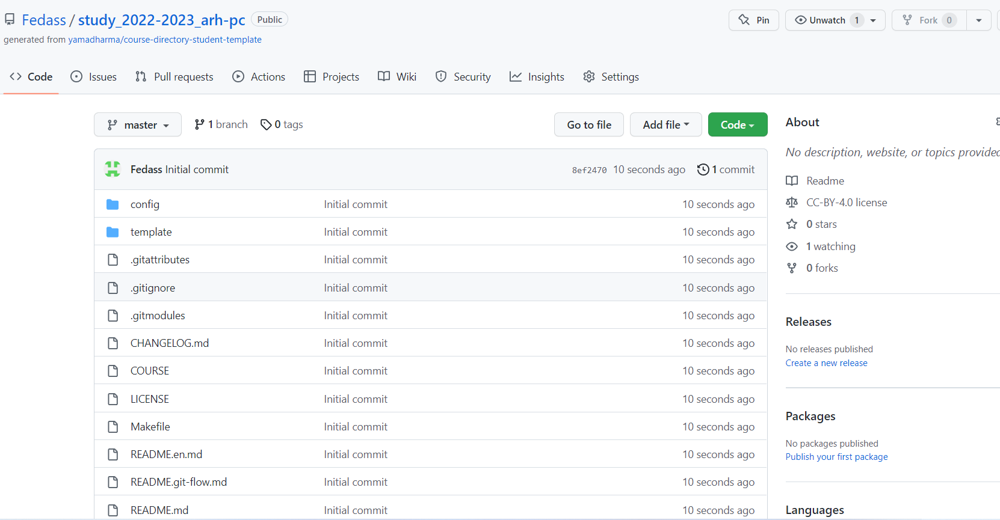  {#fig:001 width=70% }
Рис. 3.3. Каталог репозитория.
4. Клонирование созданного репозитория.
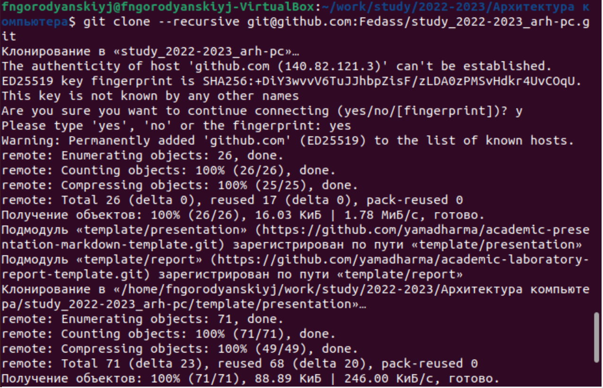  {#fig:001 width=70% }
Рис. 4. Клонирование репозитория.
5. Настройка проекта.
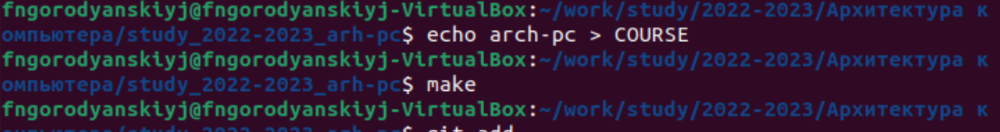  {#fig:001 width=70% }
Рис. 5. Настройка проекта.
6. Создание проекта.
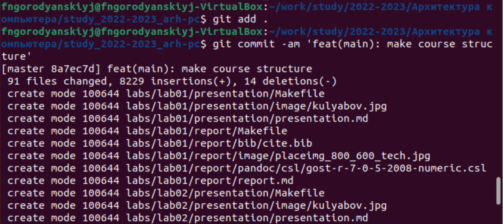  {#fig:001 width=70% }
Рис. 6. Создание нового проекта.
7. Проверка создания каталогов на сервере.
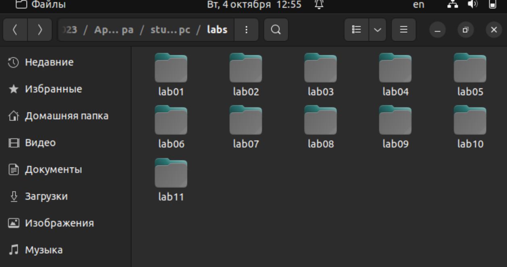  {#fig:001 width=70% }
Рис. 7.1. Проверка создания каталогов на сервере.
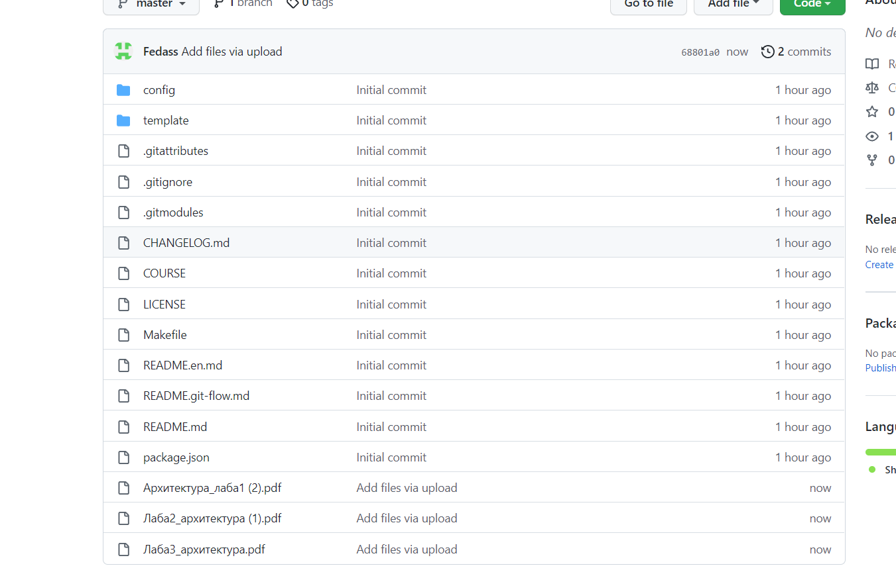  {#fig:001 width=70% }
Рис. 7.2. Проверка создания проекта на Git.

8. Создал отчет по лабораторной работе №3 в папке lab_03.
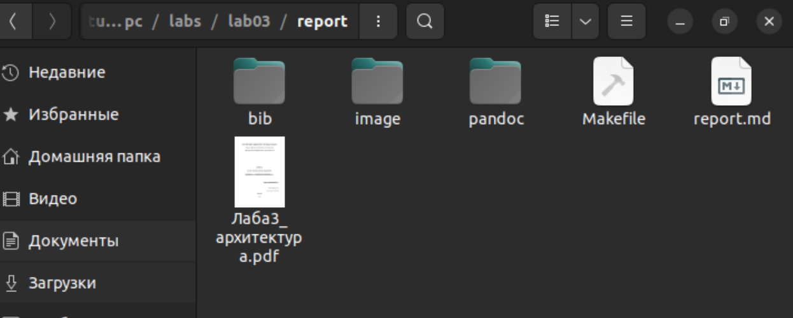  {#fig:001 width=70% }
Рис. 8. Создание отчета.
9. Создал отчет по лабораторной работе №1 в папке lab_01.
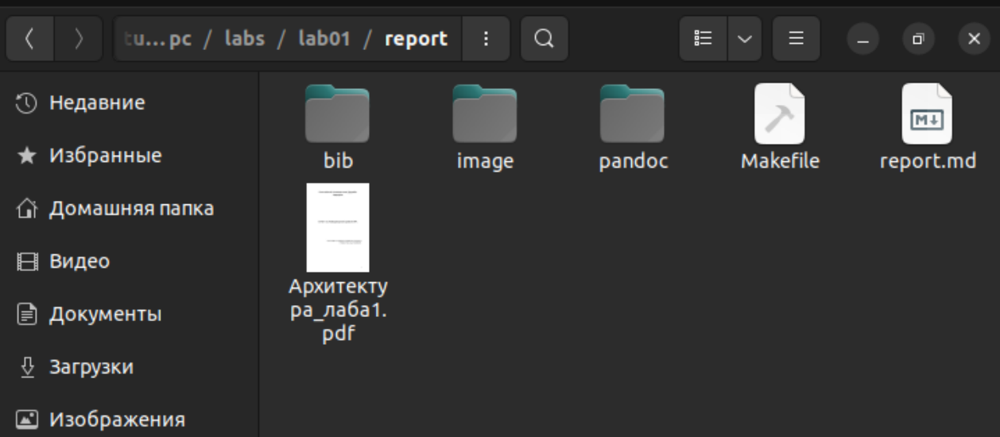  {#fig:001 width=70% }
Рис. 9.1. Создание отчета.
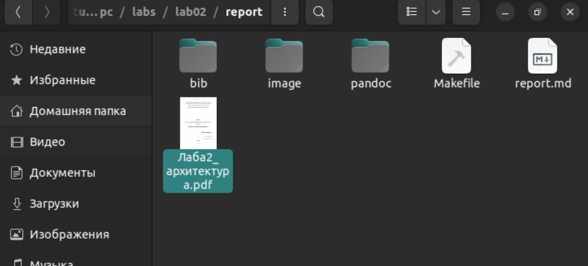  {#fig:001 width=70% }
Рис. 9.2. Создание отчета.
10. Загрузка файлов на страницу git.
  {#fig:001 width=70% }
Рис. 10. Загрузка файлов на страницу git.

# Выводы

В результате работы я получил навыки работы с системой
контроля версий Git.

# Список литературы{.unnumbered}

::: {#refs}
:::
