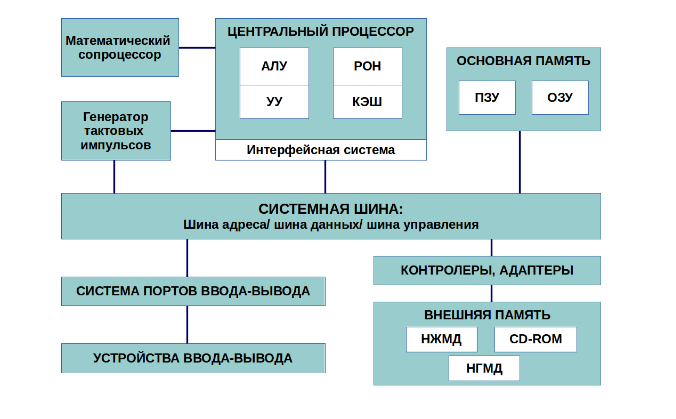
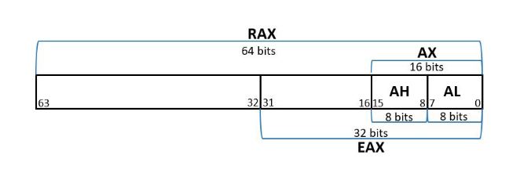
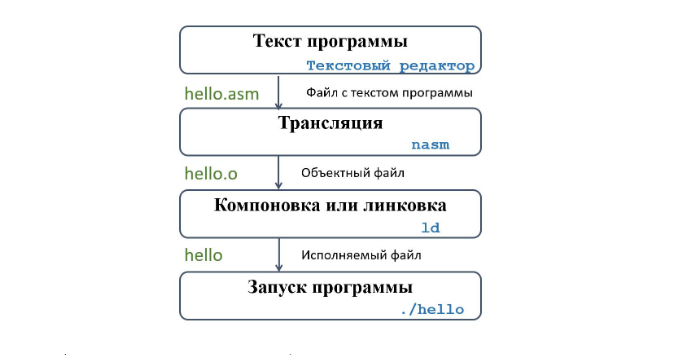
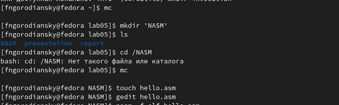
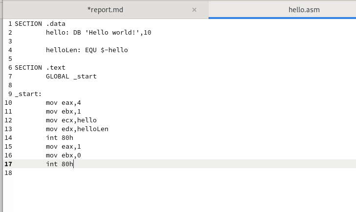
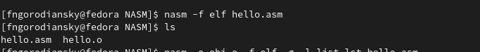
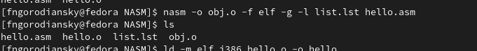
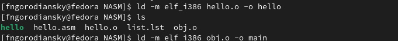
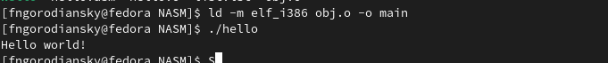
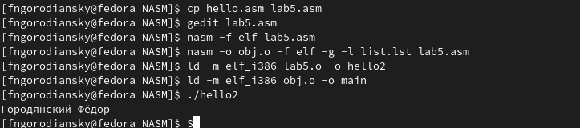

---
## Front matter
title: "Отчёт по лабораторной работе №5"
subtitle: "Создание и процесс обработки программ на языке ассемблера NASM"
author: "Городянский Фёдор Николаевич"

## Generic otions
lang: ru-RU
toc-title: "Содержание"

## Bibliography
bibliography: bib/cite.bib
csl: pandoc/csl/gost-r-7-0-5-2008-numeric.csl

## Pdf output format
toc: true # Table of contents
toc-depth: 2
lof: true # List of figures
lot: true # List of tables
fontsize: 12pt
linestretch: 1.5
papersize: a4
documentclass: scrreprt
## I18n polyglossia
polyglossia-lang:
  name: russian
  options:
	- spelling=modern
	- babelshorthands=true
polyglossia-otherlangs:
  name: english
## I18n babel
babel-lang: russian
babel-otherlangs: english
## Fonts
mainfont: PT Serif
romanfont: PT Serif
sansfont: PT Sans
monofont: PT Mono
mainfontoptions: Ligatures=TeX
romanfontoptions: Ligatures=TeX
sansfontoptions: Ligatures=TeX,Scale=MatchLowercase
monofontoptions: Scale=MatchLowercase,Scale=0.9
## Biblatex
biblatex: true
biblio-style: "gost-numeric"
biblatexoptions:
  - parentracker=true
  - backend=biber
  - hyperref=auto
  - language=auto
  - autolang=other*
  - citestyle=gost-numeric
## Pandoc-crossref LaTeX customization
figureTitle: "Рис."
tableTitle: "Таблица"
listingTitle: "Листинг"
lofTitle: "Список иллюстраций"
lotTitle: "Список таблиц"
lolTitle: "Листинги"
## Misc options
indent: true
header-includes:
  - \usepackage{indentfirst}
  - \usepackage{float} # keep figures where there are in the text
  - \floatplacement{figure}{H} # keep figures where there are in the text
---

# Цель работы

Освоение процедуры компиляции и сборки программ, написанных на ассем-
блере NASM

# Теоретическое введение

{ #fig:001 width=70% }
Рис.1. Структурная схема ЭВМ.
{ #fig:001 width=70% }
Рис.2. 64-битный регистр процессора ‘RAX’.
{ #fig:001 width=70% }
Рис.3. Процесс создания ассемблерной программы.

# Выполнение лабораторной работы

1. Создал текстовый файл hello.asm
{ #fig:001 width=70% }
Рис.1. hello.asm
2. Ввел в него программу.
{ #fig:001 width=70% }
Рис.2. программа 'hello world!'
3. Пеобразовал текст программы из файла hello.asm в объектный код.
 { #fig:001 width=70% }
Рис.3. превращение программы в обьектный код.
4. Скомпилирует исходный файл hello.asm в obj.o
 { #fig:001 width=70% }
Рис.4. компиляция файла.
5. Передал объектный файл на обработку компоновщику.
 { #fig:001 width=70% }
Рис.5. создание файла hello.
6. Запустил программу.
{ #fig:001 width=70% }
Рис.6. hello world!.
7. Создал программу, которая выводит мои фамилию и имя, оттранслировал полученный текст программы lab5.asm в объектный файл, выполнил компоновку объектного файла и запустид получившийся исполняемый файл.
{ #fig:001 width=70% }
Рис.7. Программа lab5.asm.

# Выводы

В результате работы получил навыки работы с языком ассемблера NASM.

