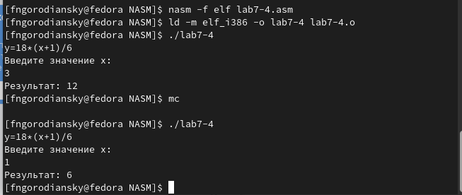

---
## Front matter
title: "Отчёт по лабораторной работе №7"
subtitle: "Арифметические операции в NASM"
author: "Городянский Фёдор Николаевич"

## Generic otions
lang: ru-RU
toc-title: "Содержание"

## Bibliography
bibliography: bib/cite.bib
csl: pandoc/csl/gost-r-7-0-5-2008-numeric.csl

## Pdf output format
toc: true # Table of contents
toc-depth: 2
lof: true # List of figures
lot: true # List of tables
fontsize: 12pt
linestretch: 1.5
papersize: a4
documentclass: scrreprt
## I18n polyglossia
polyglossia-lang:
  name: russian
  options:
	- spelling=modern
	- babelshorthands=true
polyglossia-otherlangs:
  name: english
## I18n babel
babel-lang: russian
babel-otherlangs: english
## Fonts
mainfont: PT Serif
romanfont: PT Serif
sansfont: PT Sans
monofont: PT Mono
mainfontoptions: Ligatures=TeX
romanfontoptions: Ligatures=TeX
sansfontoptions: Ligatures=TeX,Scale=MatchLowercase
monofontoptions: Scale=MatchLowercase,Scale=0.9
## Biblatex
biblatex: true
biblio-style: "gost-numeric"
biblatexoptions:
  - parentracker=true
  - backend=biber
  - hyperref=auto
  - language=auto
  - autolang=other*
  - citestyle=gost-numeric
## Pandoc-crossref LaTeX customization
figureTitle: "Рис."
tableTitle: "Таблица"
listingTitle: "Листинг"
lofTitle: "Список иллюстраций"
lotTitle: "Список таблиц"
lolTitle: "Листинги"
## Misc options
indent: true
header-includes:
  - \usepackage{indentfirst}
  - \usepackage{float} # keep figures where there are in the text
  - \floatplacement{figure}{H} # keep figures where there are in the text
---

# Цель работы

Освоение арифметических инструкций языка ассемблера NASM.

# Теоретическое введение

1. { #fig:001 width=70% }
Рис.1. Регистры используемые командами умножения в Nasm.
2. { #fig:001 width=70% }
Рис.2. Регистры используемые командами деления в Nasm.

# Выполнение лабораторной работы

1. Создал файл lab7-1.asm.
{ #fig:001 width=70% }
Рис.1. файл lab7-1.asm.
2. Записал программу вывода значения регистра eax в файл.
{ #fig:001 width=70% }
Рис.2. код.
3. Создал исполнаяемый файл и запустил его.
{ #fig:001 width=70% }
Рис.3. Вывод программы.
4. Изменил строки в коде.
{ #fig:001 width=70% }
Рис.4. Код программы.
5. Заново создал его и запустил.
{ #fig:001 width=70% }
Рис.5. Вывод программы.
6. В созданном файле lab7-2.asm записал программу вывода значения регистра eax.
{ #fig:001 width=70% }
Рис.6. Код программы.
7. Запуск последующих 3 программ с изменениями.
{ #fig:001 width=70% }
Рис.7. Вывод программы.
8. Написал программу вычисления выражения и впоследствии запустил.
{ #fig:001 width=70% }
Рис.8. Вывод программы.
9. Написал программу вычисления варианта задания по
номеру студенческого билета.
{ #fig:001 width=70% }
Рис.9. Вывод программы.
Ответы на вопросы:
1. rem: DB 'Ваш вариант: ',0
2. для записи в переменные числовых значений.
3. для вызова подпрограммы преобразования ASCII кода в число.
4. xor edx,edx
   mov ebx,20
   div ebx
   inc edx
5. ebx
6. для записи целой части деления.
7. mov eax,rem
   call sprint
   mov eax,edx
   call iprintLF

10. Написал программу для вычисления значения функции.
 { #fig:001 width=70% }
Рис.10. Код программы.
11. Запустил программу.
{ #fig:001 width=70% }
Рис.11. Вывод программы.

# Выводы

В результате получил навыки работы с арифметическими операциями языка NASM.

# Список литературы{.unnumbered}

::: {#refs}
:::
